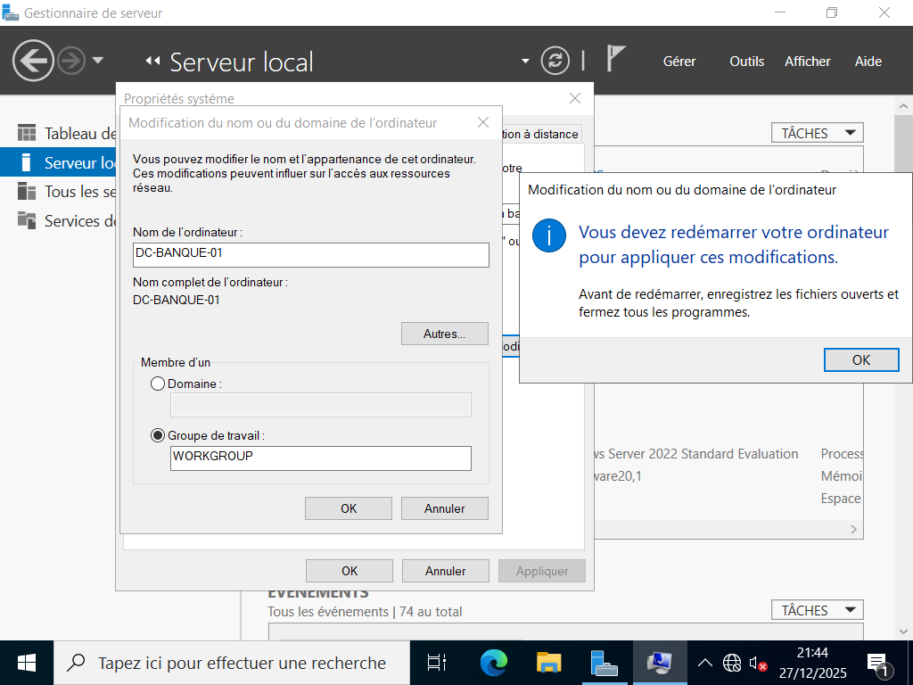

# Active Directory – Windows Server 2022

## 📌 Présentation du projet
Ce projet documente la mise en place complète d’un **Active Directory sous Windows Server 2022** dans un environnement de laboratoire, en suivant les bonnes pratiques professionnelles et la documentation Microsoft.

L’objectif est de comprendre **le pourquoi**, **le comment** et **les impacts** de chaque configuration réalisée.

---

# Active Directory Windows Server 2022

## 🎯 Objectifs
- Déployer un contrôleur de domaine (DC)
- Mettre en place les services essentiels (DNS, DHCP,serveur de fichier)
- Gérer les utilisateurs, ordinateurs et OU
- Appliquer des stratégies de groupe (GPO)
- Préparer une base sécurisée et évolutive

---

## 🏗️ Architecture du lab
- Domaine : `banque.local`
- Contrôleur de domaine : `DC-BANQUE-01`
- Rôle AD DS
- DNS intégré à Active Directory
- DHCP pour la distribution automatique des adresses IP

---

## ⚙️ Mise en œuvre

### 1️⃣ Installation d’Active Directory
- Installation du rôle AD DS
- Promotion du serveur en contrôleur de domaine
- Création du domaine

---

### 2️⃣ Configuration DNS
- Zone de recherche directe
- Zone de recherche inversée
- Vérification de la résolution de noms

[Console DNS](./active-directory-window-server-2022/screenshoots/dns.png)
[Zone de recherche directe](./active-directory-window-server-2022/screenshoots/recherche-directe.png)--
[Zone de recherche inversée](./active-directory-window-server-2022/screenshoots/recherche-inverser.png)

---

### 3️⃣ Configuration DHCP
- Création de l’étendue DHCP
- Paramètres IP (passerelle, DNS)
- Autorisation du serveur DHCP dans l’AD

 [Étendue DHCP active](./active-directory-window-server-2022/screenshoots/dhcp.png)--
 [parametre IP](./active-directory-window-server-2022/screenshoots/adresseip.png)

---

### 4️⃣ Organisation Active Directory
- Création des OU
- Ajout des utilisateurs et groupes
- Intégration des postes clients au domaine

[OU et utilisateurs dans ADUC](./active-directory-window-server-2022/screenshoots/O_U.png)--
[ utilisateurs et groupes](./active-directory-window-server-2022/screenshoots/client.png)

---

### 5️⃣ Stratégies de Groupe (GPO)
- Sécurisation des postes utilisateurs
- Restrictions système
- Application des GPO par OU

[Console GPMC](./active-directory-window-server-2022/screenshoots/console-gpo.png)--
[blocage de 03 tentative de connexion](./active-directory-window-server-2022/screenshoots/mauvaise-connexion.png)--
[blocage application non autorisé par le controleur de domaine](./active-directory-window-server-2022/screenshoots/application-nonautorisé.png)--
[journalisation et logs](./active-directory-window-server-2022/screenshoots/jounalisationlog.png)--
[blocage stockage amovible utilisateur standard](./active-directory-window-server-2022/screenshoots/amovible.png)--
[Restrictions système](./active-directory-window-server-2022/screenshoots/systeme.png)--
[partage fichier reseau](./active-directory-window-server-2022/screenshoots/filserver.png)--
[etc..]

## 🔐 Sécurité et bonnes pratiques
- Centralisation de l’authentification
- Gestion des droits par groupe
- Base prête pour IDS/IPS et audits de sécurité

---

## ⚠️ Limites du projet
- Environnement de laboratoire
- Pas de redondance multi-DC
- Sécurité avancée non encore déployée (SIEM, IDS/IPS)

---

## 🚀 Évolutions possibles
- Ajout d’un second contrôleur de domaine
- ajout des GPO avancer
- Mise en place d’un IDS/IPS
- Scénarios d’attaque et de défense Active Directory
- Automatisation via PowerShell

---

## 📚 Références
- Documentation Microsoft – Active Directory Domain Services (Windows Server 2022)

---

## 👤 Auteur
**Rodrigue O. K. Balogou**  
Étudiant en Systèmes et Sécurité des Réseaux Informatiques
